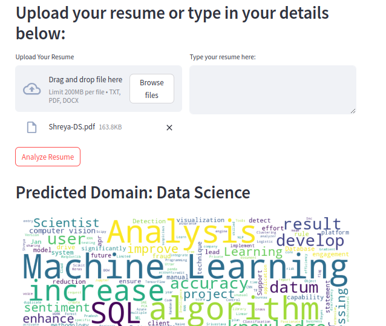

# Resume Insights Studio

Welcome to Resume Insights Studio! This Streamlit app is designed to analyze resumes, predict their domain (e.g., Data Science, Testing), and generate a word cloud of the keywords present in the resume.

## Features

- **Domain Prediction**: Classifies the resume into different domains such as Data Science, Testing, etc.
- **Word Cloud Generation**: Creates a visual representation of the most frequently used words in the resume.

## Installation

To get started with the app, you'll need to install the required Python libraries. You can do this using 
pip install requirements.txt

## How to Run

1. Clone the repository to your local machine:

2. Navigate to the project directory:

3. Run the Streamlit app:

4. Open your web browser and go to the URL provided by Streamlit (typically `http://localhost:8501`).

## Usage

1. **Upload a Resume**: Use the file uploader to select a resume (preferably in txt,pdf or docx format).

2. **View Predictions**: The app will display the predicted domain for the resume.

3. **View Word Cloud**: The app will generate and display a word cloud showing the most frequent words used in the resume.
